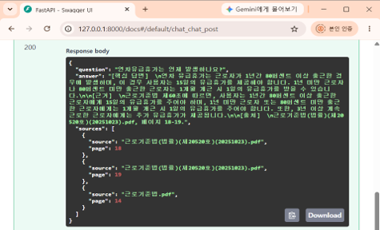
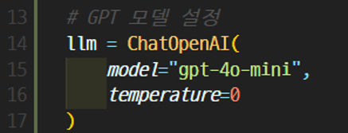
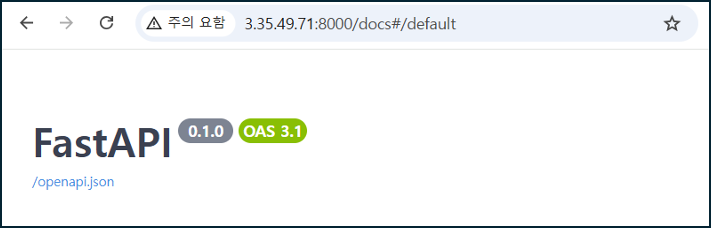

# Legal RAG System



법률 PDF 문서를 기반으로 사용자의 질문에 답변하는 RAG(Retrieval-Augmented Generation) 기반 법률 질의응답 시스템입니다.

---

## 프로젝트 소개

근로기준법, 개인정보보호법, 산업안전보건법 등 다양한 법률 PDF 문서를 검색하여 사용자 질문에 대한 답변을 제공합니다.

단순 키워드 검색이 아닌 RAG(Retrieval-Augmented Generation)와 OpenAI GPT-4o-mini를 활용하여 자연어 기반의 답변을 생성합니다.

---

## 주요 기능

* 자연어 기반 법률 질의응답
* 법률 PDF 문서 검색
* RAG 기반 벡터 검색
* GPT-4o-mini 답변 생성
* 출처 문서 및 페이지 제공
* AWS EC2 + Docker 배포

---

## 🛠 기술 스택

### Backend

* Python
* FastAPI

### AI

* LangChain
* LangGraph
* OpenAI GPT-4o-mini
* HuggingFace Embeddings
* FAISS

### Infra

* Docker
* AWS EC2

### Version Control

* GitHub
* Git

## 🤖 GPT 연동



OpenAI GPT-4o-mini 모델을 활용하여 검색된 법률 문서를 기반으로 답변을 생성하였습니다.

---

## 📂 프로젝트 구조

```text
rag-project
│
├── app
│   ├── main.py
│   ├── graph.py
│   ├── rag.py
│   └── data
│
├── requirements.txt
├── Dockerfile
└── README.md
```

---

## 시스템 동작 흐름

사용자 질문 입력

↓

관련 법률 문서 검색 (RAG)

↓

관련 문서 추출

↓

GPT-4o-mini 답변 생성

↓

출처 문서 및 페이지 반환

---

## 프로젝트 결과

* 약 935페이지 규모의 법률 PDF 활용
* 법률 질의응답 시스템 구현
* GPT-4o-mini 기반 답변 생성
* Docker 컨테이너 배포
* AWS EC2 환경 운영

## ☁️ AWS 배포



Docker 컨테이너 기반으로 AWS EC2 환경에 배포하였으며,
공인 IP를 통해 외부에서 API 접근이 가능하도록 구성하였습니다.

---

## 실행 방법

### 패키지 설치

```bash
pip install -r requirements.txt
```

### 서버 실행

```bash
uvicorn app.main:app --reload
```

### Swagger 접속

```text
http://127.0.0.1:8000/docs
```

---

## 트러블슈팅

### 1. 질문과 관련 없는 문서가 검색되는 문제

* 문서 Chunking 적용
* 검색 정확도 향상

### 2. 검색 결과만으로는 답변이 자연스럽지 않은 문제

* GPT-4o-mini 연동
* 사용자 친화적 답변 생성

### 3. Docker 빌드 중 저장공간 부족 문제

* AWS EBS 볼륨 확장 (8GB → 30GB)
* Docker 이미지 빌드 정상 수행

